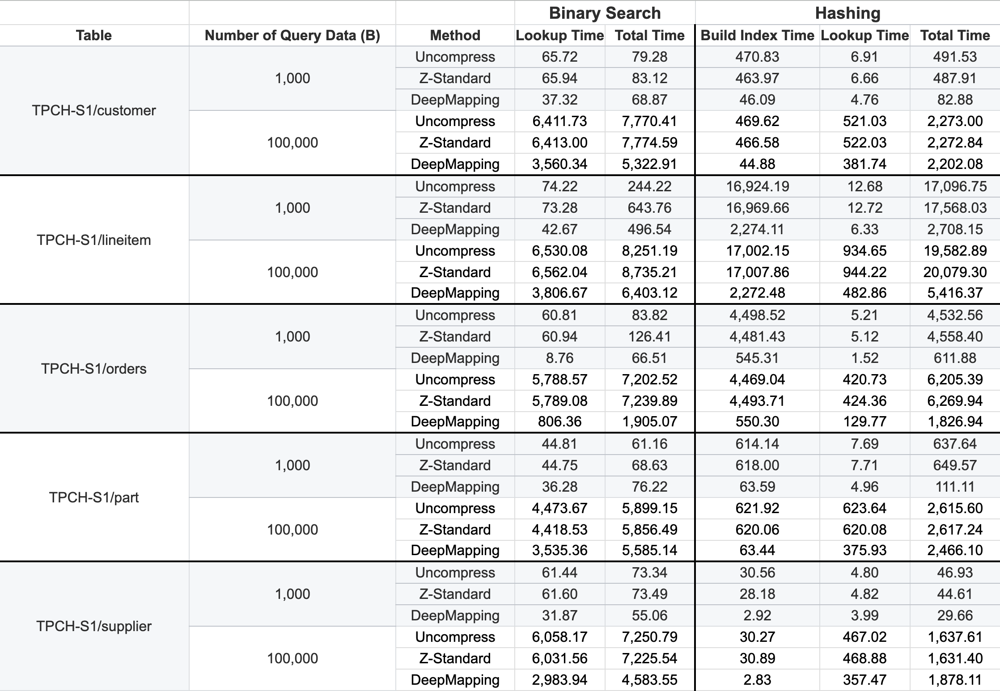
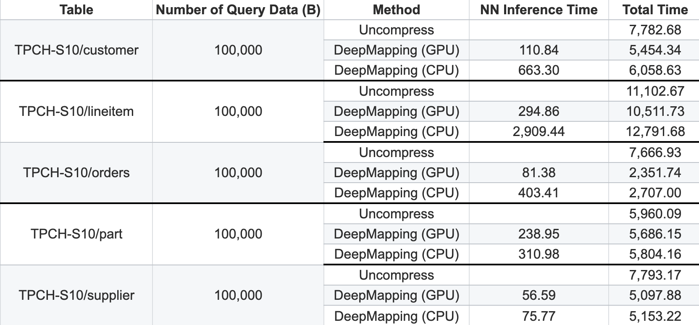
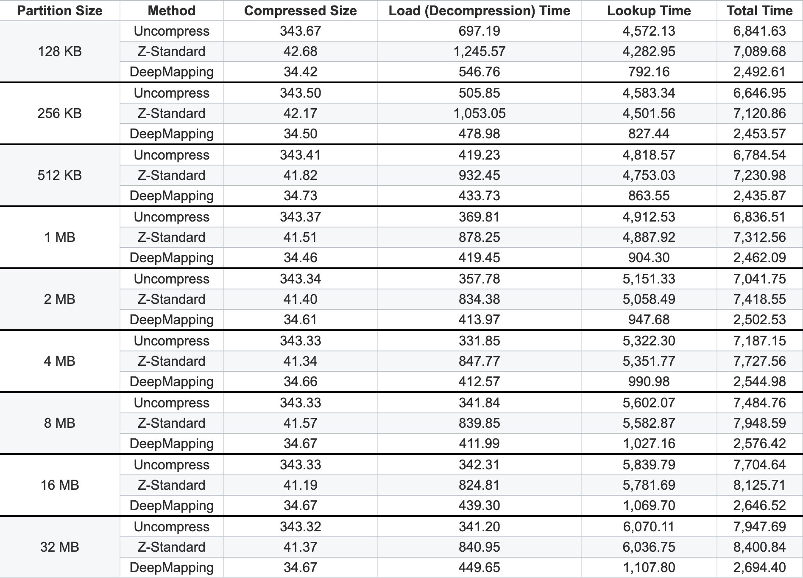

# DeepMapping: The Case for Learned Data Mapping for Compression and Efficient Query Processing

Resources for SIGMOD 2024 Submission

<!-- TOC -->

- [DeepMapping: The Case for Learned Data Mapping for Compression and Efficient Query Processing](#deepmapping-the-case-for-learned-data-mapping-for-compression-and-efficient-query-processing)
    - [Set-Up](#set-up)
    - [Dataset](#dataset)
    - [Model Searching](#model-searching)
    - [Benchmark](#benchmark)
        - [Task: Data Query](#task-data-query)
        - [Task: Data Manipulation](#task-data-manipulation)
    - [Supplemental Material](#supplemental-material)
        - [Comparison of end-end latency using hashing and binary search](#comparison-of-end-end-latency-using-hashing-and-binary-search)
        - [Comparison of end-end latency for running model in CPU/GPU](#comparison-of-end-end-latency-for-running-model-in-cpugpu)
        - [Comparison of tunning the partition size](#comparison-of-tunning-the-partition-size)

<!-- /TOC -->

## Set-Up

1. Please install the required dependencies via `pip install -r requirements.txt`

2. DeepMapping is wrapped up as a Python library, please run the following command to install it.

    ```
    cd DeepMapping
    pip install -e ./
    ```

3. We wrapped up the feature extraction as a C-based function for better performance. Run the following command to compile it as a shared library.

    ```
    cc -fPIC -shared -o shared_utils.so shared_utils.c
    ```

## Dataset

Our experiments covered synthetic datasets, low/high correlation datasets with different scales(100MB, 1GB, 10GB), and TPC-H, TPC-DS benchmark datasets with scale factors as 1 and 10. We removed all string/continuous columns and uploaded our pre-generated datasets to [**HERE**](https://mega.nz/file/aUREBDQI#vW-rUQOTOr0B7uN9XhcOFXd2dqfe5yA18-Mk3xn-Dvc):

[**DATA LINK: https://mega.nz/file/aUREBDQI#vW-rUQOTOr0B7uN9XhcOFXd2dqfe5yA18-Mk3xn-Dvc**](https://mega.nz/file/aUREBDQI#vW-rUQOTOr0B7uN9XhcOFXd2dqfe5yA18-Mk3xn-Dvc)

After download it, please unzip it to the **root** folder of this GitHub repository. Then, you will see a **dataset**  folder here.

List of datasets:

- TPC-H (S1/S10): `customer`, `lineitem`, `orders`, `part`, `supplier`.
- TPC-DS (S1/S10): `catalog_page`, `catalog_returns`, `catalog_sales`,`customer_address`, `customer_demographics`, `customer`, `item`, `store_returns`, `web_returns`.
- Synthetic Dataset (100MB, 1GB, 10GB): `single_column_low_correlation`, `single_column_high_correlation`, `multiple_column_low_correlation`, `multiple_column_high_correlation`.


## Model Searching

1. Please run `python run_search_model.py` to perform a NAS with given dataset. You can configure the NAS by editing the **run_search_model.py** correspondingly. The searched result will be printout.

2. Modify the `SEARCH_MODEL_STRUCTURE` in `run_train_searched_model.py` with the output from step 1. And then run `python run_train_searched_model.py` to train a model.

## Benchmark 

We provided some example models for the following 2 tasks. Please go [**HERE**](https://mega.nz/file/SdYWHAzZ#AAuYAz_-UmHXWUixHGOzzBJN0NTmwY6N66da3UyRS9s) to download:

[**MODEL LINK: https://mega.nz/file/SdYWHAzZ#AAuYAz_-UmHXWUixHGOzzBJN0NTmwY6N66da3UyRS9s**](https://mega.nz/file/SdYWHAzZ#AAuYAz_-UmHXWUixHGOzzBJN0NTmwY6N66da3UyRS9s)

After download it, please unzip it to the **root** folder of this GitHub repository. Then, you will see a **models**  folder here.


### Task: Data Query

These experiments measured overall storage overhead and end-end query latency for benchmark datasets, i.e. TPC-H and TPC-DS. 
Run `python run_benchmark_data_query.py` to benchmark. To benchmark with different dataset, you should modify the file correspondingly by following the instructions provided in the python file.

### Task: Data Manipulation

These experiments measured overall storage overhead and end-end query latency for synthetic dataset with data manipulation, i.e. INSERT/UPDATE/DELETE. Run `python run_benchmark_data_manipulation.py` to benchmark it. To benchmark with different dataset, you should modify the file correspondingly by following the instructions provided in the python file.

## Supplemental Material

All latency values are measured in ms.
### Comparison of end-end latency using hashing and binary search


### Comparison of end-end latency for running model in CPU/GPU


### Comparison of tunning the partition size

Experiments results are measured on TPC-H, SF=10, `orders` table, B=100,000

